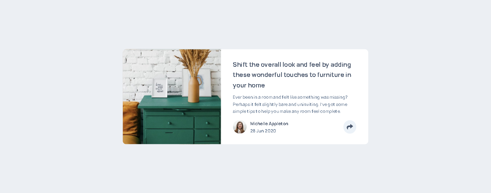
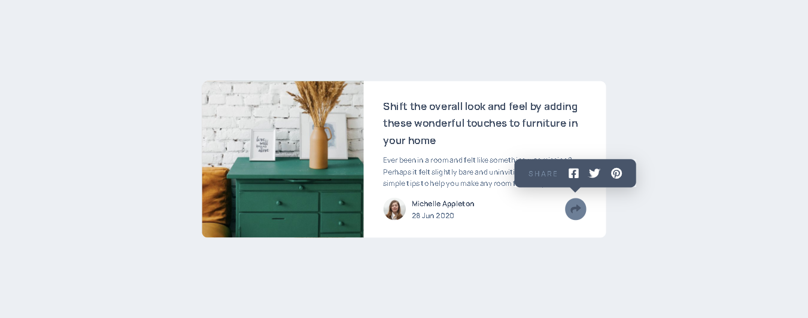
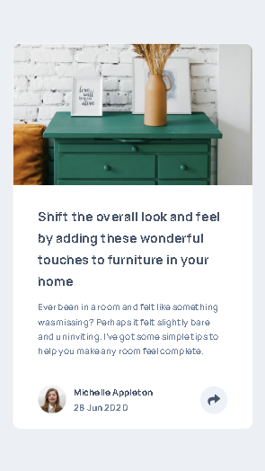
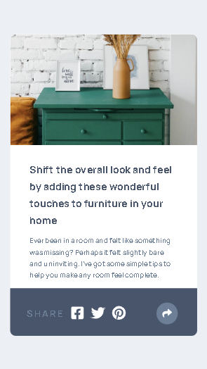

# Article Preview Component - html, css, sass, javascript
You are able to: 
- View the optimal layout for the component depending on your device's screen size
- See the social media share links when you click the share icon

## Table of contents

- [Overview](#overview)
  - [Links](#links)
- [My process](#my-process)
  - [Built with](#built-with)
- [Author](#author)
- [Usage](#usage)
- [Screenshot](#screenshot)

## Overview

### Links

- Live Site URL: [GitHub Pages](https://frontendparham.github.io/Iran-Natures/)

## My process

### Built with

- HTML
- CSS
- SASS
- JavaScript

## Author

- Parham Tavakolian
- Instagram - [@frontendparham](https://www.instagram.com/frontendparham)
- GitHub - [@frontendparham](https://www.github.com/frontendparham)

## Usage

```
# Install dependencies
npm install

# Watch CSS & run live server
npm run start

# Build CSS and assets
npm run build:css
```

## Screenshot





